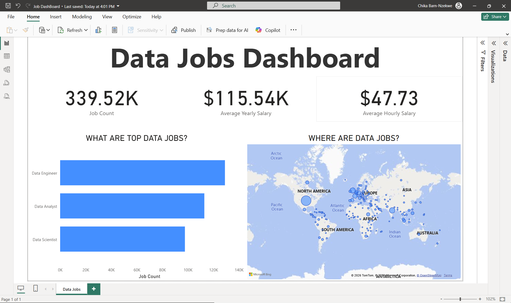

# 📊 Data Jobs Dashboard (Power BI)

## 📌 Project Overview

This Power BI dashboard analyzes 2024 data job postings to uncover insights about:

- Job demand
- Salary trends
- Geographic distribution
- Top hiring roles

Built for job seekers and data professionals to understand the market at a glance.

---

## 📂 Dataset

Includes:
- Job titles
- Yearly salaries
- Hourly salaries
- Locations
- Work-from-home data

Raw data available in:
Data/data_jobs_2024.csv

---

## 🛠 Skills Demonstrated

- Data cleaning with Power Query
- Creating measures (Job Count, Average Salary)
- KPI Cards
- Bar Charts
- Map Visualization
- Drill-through pages
- Interactive slicers

---

## 📎 Files

- Data_Jobs_Dashboard.pbix
- Data/data_jobs_2024.csv
- Images/dashboard-overview.png

---

## 👩🏾‍💻 Author

Chika Barn
